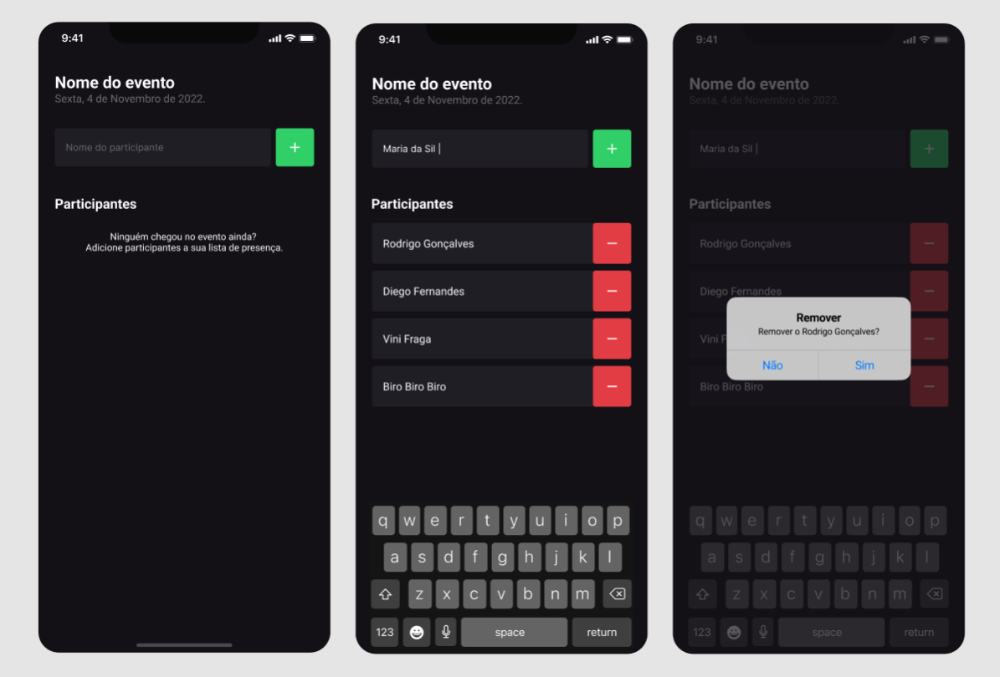

# Fundamentos do React Native - Projeto Im Here

É uma aplicação para gerenciar os participantes em eventos, como em palestras e workshops.

<div align="center">
    
</div>


## 🚀 Aprendizados

- O que é React Native
    - Quem usa?
    - O que é expo?
- Criar um projeto
    - Estrutura de pastas e arquivos
    - Executar o projeto
- Funcionamento do React Native
    - Refresh e Reload
    - JSX
- Estilização de Elementos
    - Densidade de pixel
    - StyleSheet
    - Flex Direction
- Organização do Projeto
- Export e Export Default
- Componentes
    - TextInput
    - TouchableOpacity
    - Criando um COmponente
    - Propriedades
    - StatusBar
    - Listas
        - ScrollView
        - FlatList
- Alert
- Hooks
    - Conceito de Hooks
    - useState
    - Imutabilidade
    - State e TextInput
    - Render
    - Manipulação de Estados
    - Estado Assíncrono

## :arrow_forward: Instalação e uso

Clone o projeto e acesse a pasta

```bash
$ git clone https://github.com/evertonvargas/ignite-rn-01-im-here

```

Siga os passos abaixo
```bash
# Install the dependencies
$ npm i

# Start the project
$ expo start
```
